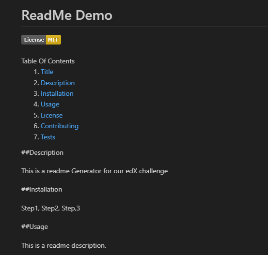

This is a ReadMe Generator. 

With this task I utilised the inquirer package via NPM and node.js. 

The task satifies all of the below which is from the acceptance criteria.

Create a command-line application that accepts user input.

When a user is prompted for information about the application repository, a high-quality, professional README.md is generated with:

The title of my project

Sections entitled:

Description

Table of Contents

Installation

Usage

License

Contributing

Tests

Questions

When a user enters the project title, it's displayed as the title of the README.

When a user enters a description, installation instructions, usage information, contribution guidelines, and test instructions, this information is added to the sections of the README entitled Description, Installation, Usage, Contributing, and Tests.

When a user chooses a license for their application from a list of options, a badge for that license is added near the top of the README and a notice is added to the section of the README entitled License that explains which license the application is covered under.

When a user enters their GitHub username, it's added to the section of the README entitled Questions, with a link to their GitHub profile.

When a user enters their email address, it's added to the section of the README entitled Questions, with instructions on how to reach them with additional questions.

When a user clicks on the links in the Table of Contents, they are taken to the corresponding section of the README.

Link to the Demo: https://www.loom.com/share/fa85e250677d4e82b5dad8c295eb0e10?sid=a07d1b7b-70fb-49e8-868e-3b75dd914ab3

Link to my GitHub Repo: https://github.com/dpaul93/ReadMe-Generator-Dominic-